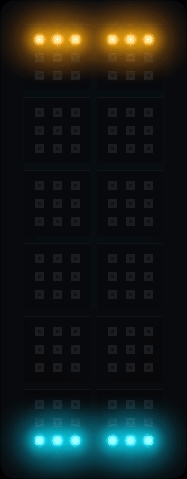
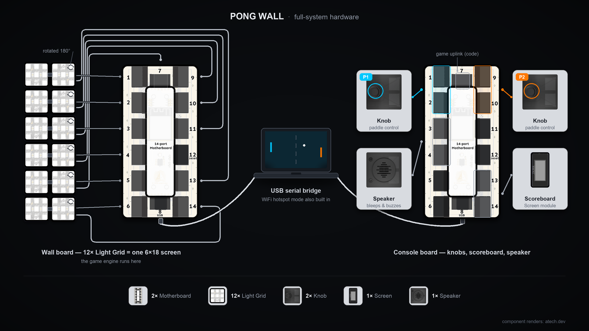
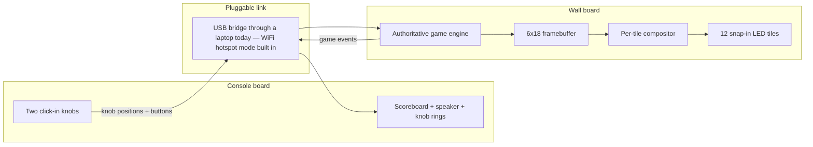
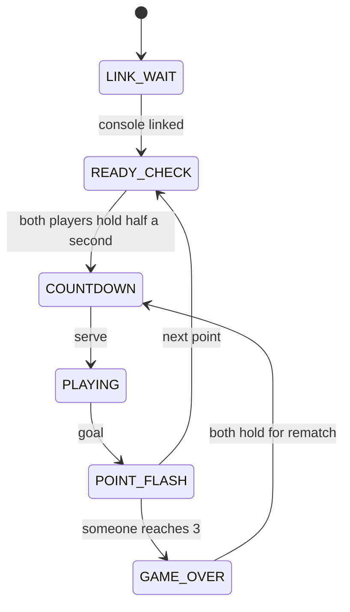
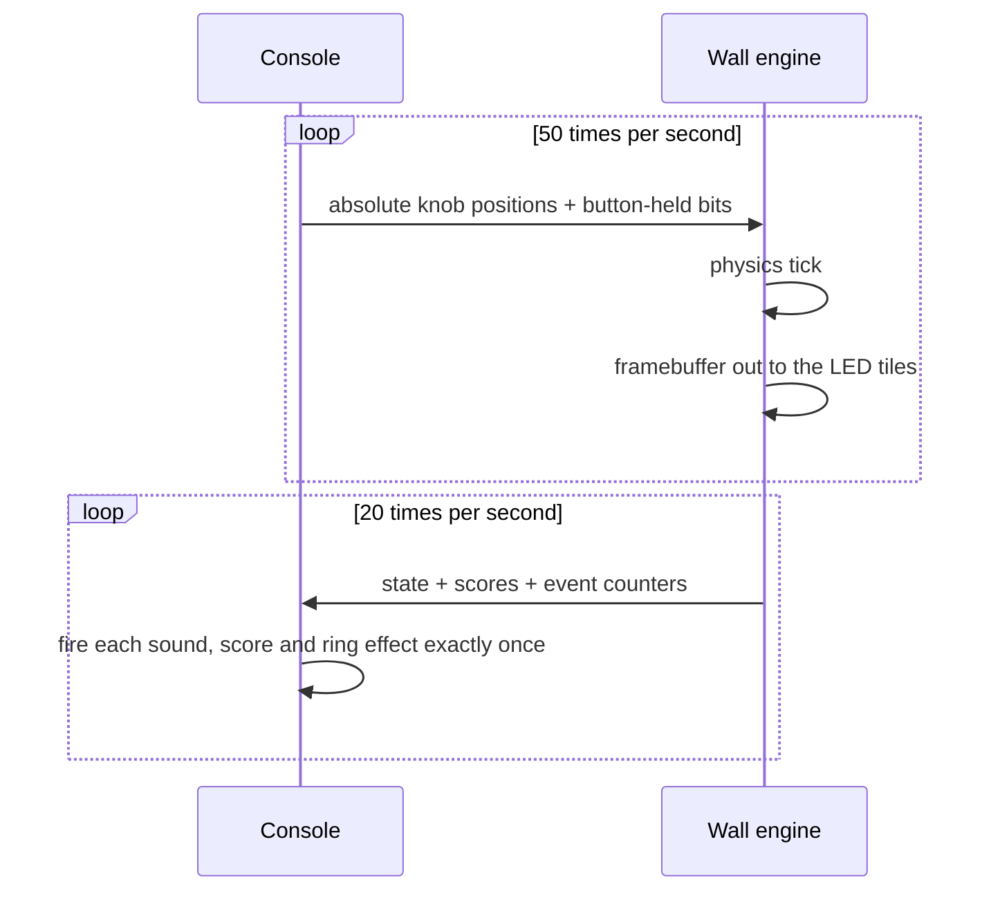

# PONG WALL 🏓

**Two-player Pong on a wall of 108 LEDs, played with click-in knobs — built in one day at the [atech.dev](https://atech.dev) hackathon.**

<table>
  <tr>
    <td align="center" valign="top">
      
    </td>
    <td align="center" valign="top">
      
    </td>
  </tr>
</table>

*The wall GIF is the real firmware engine playing itself.*

## The build

Two little ESP32-S3 boards, no soldering, everything clicks together.

**The wall.** One board carries 12 snap-in 3×3 LED tiles — that's a 6×18 pixel display — and runs the entire game on-board: physics, scoring, rendering, all of it.

**The console.** A second board is the players' station: two clickable rotary knobs (each wrapped in its own 12-LED ring), a 160×80 color scoreboard screen, and a speaker that plays jingles when things happen.

All of it is modular atech.dev hardware — tiles, knobs, screen and speaker just click into ports on the boards. The hardest physical step of the whole project was pushing firmly.

### What plugs in where



*Half the wall's tiles click straight into ports 1–6; the other six are rotated 180°, mounted flush beside them, and cabled back to ports 7–14 — that's what makes twelve 3×3 tiles read as one 6×18 screen. The laptop in the middle is the USB serial bridge between the boards. Component renders by [atech.dev](https://atech.dev).*

## How to play

**Both players hold their knobs in for half a second.** That's the start button — and it's also how play resumes after *every* point, so nobody ever gets ambushed by a serve while reaching for their drink. Your knob's LED ring fills up as you hold; when both players lock in, the countdown starts.

Then it's Pong, but with opinions:

- **First to 3** wins the match.
- **Twist your knob** to move your paddle along the short edge of the wall.
- **Hit with the paddle's edge** to put english on the ball and send it off at a sharp angle. That's the skill move.
- **Every hit speeds the ball up.** Rallies escalate. Panic is part of the design.
- Your knob ring doubles as your **score dial** during play, the speaker celebrates every point and the win, and the scoreboard tracks the whole match.

Won? Both players hold again for an instant rematch.

## How it works

Two boards, one pluggable link between them:



The wall board is the referee: it owns the ball, the paddles and the score. The console is eyes, ears and hands — it streams what the players are doing and turns the wall's answers into sound, light and numbers.

A match moves through a small state machine on the wall:



And here's the heartbeat of a single point:



### Why it never desyncs

The link is allowed to be flaky, because the protocol doesn't care:

- **Knob positions travel as absolute values**, not deltas — a lost packet changes nothing, the next one carries the full truth.
- **One-shot events are numbered.** The console fires a jingle when a counter ticks up, so a duplicated packet can't replay a sound and a gap can't skip one.
- **The wall is the single source of truth.** The console never guesses at game state; it just renders whatever the wall last said.

### The same engine runs everywhere

The game logic is dependency-free C++ — no hardware headers, no framework. The exact same files compile into the ESP32 firmware *and* into a terminal simulator, which is how the paddle feel, ball speeds and spin angles got tuned before a single LED existed. It's also why the hero GIF above could be rendered straight from the real engine.

## Hackathon war stories

**The board swap.** Two physically identical boards, and at some point each got flashed with the other's firmware. Nothing crashed — instead, the pins meant to drive the scoreboard screen sprayed electrical garbage at an LED tile, which lit up in mysterious green pixels. Debugging a display bug that was actually an identity crisis: highly recommended.

**"Cyan was right."** The LED tiles were mounted rotated, and inside each tile the pixels snake back and forth in serpentine order. Rather than reason it out, we flashed a test pattern that cycles through all 8 candidate orientation mappings, each labeled with its own color, and just looked at the wall. The entire calibration fix was the sentence "cyan was right".

**The great transport swap.** A hall full of identical ESP32 kits is a war zone at 2.4 GHz. We renamed our too-generically-named hotspot, then fixed the ESP32's modem power-save silently eating wall-to-console packets — and when the venue RF *still* wouldn't behave, we swapped the entire transport for a USB serial bridge through a laptop in about 20 minutes. That was only possible because the link had lived behind a tiny interface since day one. The wireless mode still ships in the code, waiting for a quieter room.

**The dark wall.** Mid-debug, the whole wall went black. Cue frantic scrolling through recent changes, growing dread, existential firmware doubt. It was a loose connector.

**A moment of silence for `pong`.** The game instance was named `pong`. So was `namespace pong`. C++ had feelings about this. The instance is called `game` now, and we don't talk about it.

## Run it

With the hardware (find your two boards first with `uv run atech ports`):

```bash
# flash the wall
uv run atech build screen && uv run atech upload screen

# flash the console
uv run atech build controller && uv run atech upload controller

# connect them through your laptop
.venv/bin/python -u tools/serial_bridge.py <controller-port> <wall-port>
```

No hardware? Play the exact same engine in your terminal:

```bash
make -C sim && ./sim/pong_sim
```

Controls are shown in-app.

## Credits

Built by:

- [Nikita Suprun](https://github.com/NikitaSuprun)
- [Frederik Spang](https://github.com/Kafresma90)
- [Felix Meli](https://github.com/felnx)
- [Anton Wärnberg](https://github.com/BlueSnowman112)

Made at the **atech.dev hackathon**, on atech boards and the atech SDK. Game design, firmware, calibration — and this page — all produced during the event. 🎉
