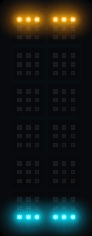
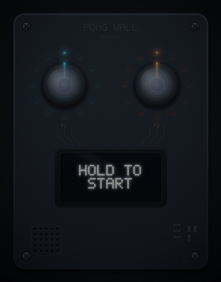

# Atech Arcade

**A retro game console and an ambient pixel display — in one thing that clicks together from Atech modules. No soldering.**

*Powered by Atech.*

<table>
  <tr>
    <td align="center" valign="top">
      
    </td>
    <td align="center" valign="top">
      
    </td>
  </tr>
</table>

*Both GIFs are the real firmware — the left is the actual game engine rendering itself.*

---

## The one-line hook: two gadgets in one

> A **$229 Playdate plays alone. A $199 Tidbyt just sits there.**
> Atech Arcade is **$249 and does both** — it's a console you play *and* an ambient pixel display that lives on your shelf when you're not playing.

When someone's playing, it's Pong, Snake, Invaders, Flappy, egg-catch, Doodle Jump and a jukebox — ten games in all. When nobody's playing, the 108-pixel matrix becomes a clock, a now-playing visualizer, or a slow-drifting pixel-art scene. One purchase, two reasons to keep it out on the desk.

---

## What it is

Two Atech ESP32-S3 boards that snap together from stock modules:

- **The brain** — a 14-port Motherboard with a **160×80 color scoreboard** (ST7735 TFT), a **speaker** for jingles, and **two click-in rotary knobs**, each wrapped in its own 12-LED ring.
- **The screen** — a second Motherboard driving **twelve "Light Grid" NeoPixel tiles**: a **6×18 = 108-pixel RGB matrix** that runs the whole game on-board and doubles as the ambient display.

On top sits an **OS-like menu** that boots into a library of games and ambient modes. Everything is stock Atech hardware clicking into ports — the hardest physical step is pushing firmly.

---

## Who it's for

| Audience | Why they buy |
|---|---|
| **Gamers & gadget people** | A tactile, screen-free, two-player couch console with a growing game library — the anti-phone game night. |
| **Gift buyers** | A "wow" object under $250 that looks great on a shelf and needs no assembly skill. |
| **Classrooms & clubs** | A finished, robust build that shows what the Atech kit *becomes* — then students remix the open games. |
| **Existing Atech kit owners** | Already have the modules? Flash **Arcade OS** for $39 and your kit becomes a console tonight. |

This is how Atech reaches past the maker aisle into **gamers, gift, and classroom** — same modules, new shelves.

---

## Three value props

1. **Two devices, one price.** A console *and* an ambient display. Every competitor is only one of those — Playdate never lights up your room, Tidbyt never lets you play.
2. **Tactile, multiplayer, screen-free play.** Two chunky knobs with LED rings, a real speaker, escalating rallies — couch-competitive fun that a phone can't touch. All ten games run on real hardware today.
3. **It's Atech, all the way down.** Built from stock modules with zero solder. Every unit sold moves **five Atech module types** — and a growing game library keeps earning after the sale.

---

## Price & lineup

| SKU | What it is | Price |
|---|---|---|
| **Arcade OS** | Firmware + game library for people who already own the modules | **$39** |
| **Arcade Solo** | Single-board handheld, smaller matrix | **$149** |
| **Arcade Duo** ⭐ | The hero: full two-board console + 108-px display | **$249** |
| **Arcade Max** | Bigger matrix + WiFi *(roadmap)* | **$399** |
| **Arcade Pass** | Yearly game/ambient content, or $2–4 packs | **$19/yr** |

Anchors: **Playdate $229** (console, has a game store) · **Tidbyt $179–199** and **Divoom Pixoo-64 $199** (ambient LED displays) · **Arduboy $79 / PicoSystem $80 / Thumby $30** (tiny handhelds). Full comparison in [`bom-and-margin.md`](bom-and-margin.md).

---

## What's real today vs. what's next

We're showing a **working prototype and credible economics — not a finished retail unit.** Straight about the line:

| ✅ Real today | 🛣️ Roadmap (not at demo) |
|---|---|
| The full OS + all ten games on the 108-px matrix, on hardware | **More + downloadable** titles (first-party & community) |
| Console board: knobs, LED rings, color scoreboard, speaker | The in-console **game market** (browse + install) |
| One engine, dependency-free C++, also runs in a desktop sim | **WiFi** board-to-board and phone-as-controller |
| ~10-minute tile calibration + loss-proof link protocol | **Arcade Max** bigger-matrix hardware |
| Board-to-board link over a **laptop USB bridge** | Native WiFi link (code already in-tree; see [roadmap](roadmap.md)) |

---

*Every Arcade Duo sold moves a Motherboard, a Knob, a Speaker, a Screen — and twelve Light Grids. **Powered by Atech.***
